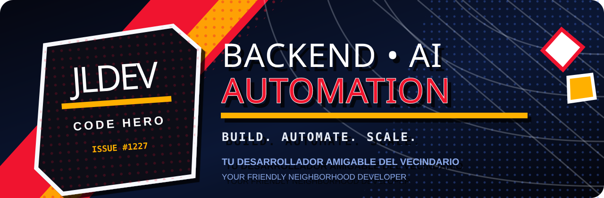
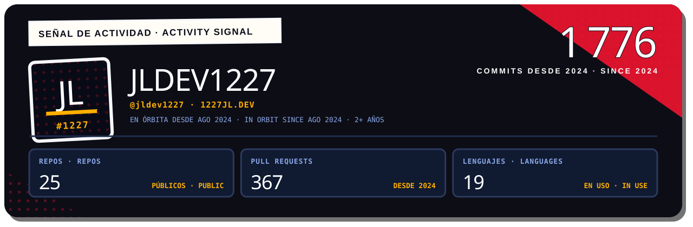
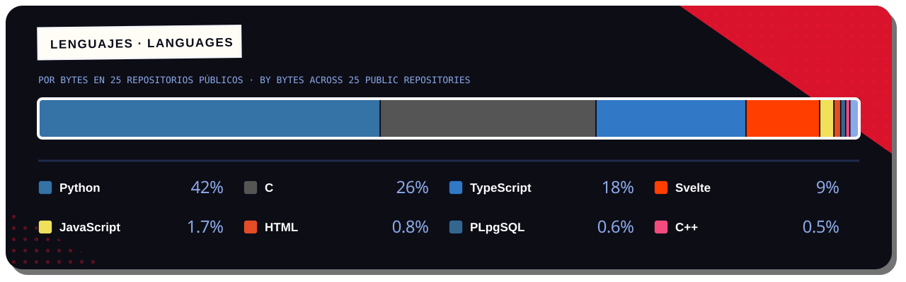
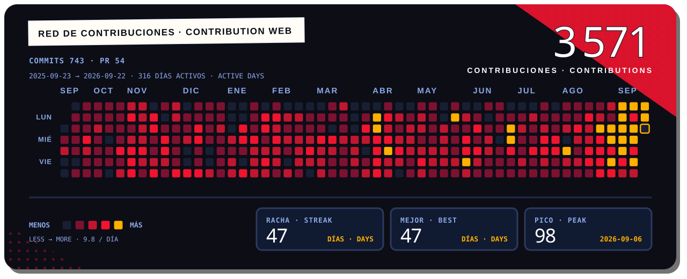
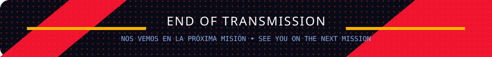

<picture>
  <source media="(prefers-color-scheme: dark)" srcset="./assets/comic-banner-dark.svg">
  <source media="(prefers-color-scheme: light)" srcset="./assets/comic-banner-light.svg">
  
</picture>

<p align="center">
  <a href="https://git.io/typing-svg">
    
  </a>
</p>

<p align="center">
  
  
  <a href="https://1227jl.dev"></a>
</p>

> **📖 Lee la historia completa · Read the full story → [1227jl.dev](https://1227jl.dev)**
> Mi portafolio contado como una página de cómic, en español e inglés.
> My portfolio told as a comic page, in Spanish and English.

## 🕷️ Mi historia de origen · Origin story

```text
ES  Desarrollo productos digitales que conectan APIs, datos, automatización e IA.
    Me obsesiona convertir procesos complejos en software simple, rápido y confiable.

EN  I build digital products that connect APIs, data, automation and AI.
    I enjoy turning complex processes into software that is simple, fast and reliable.
```

- 🕸️ **En misión / On a mission:** plataformas empresariales, integraciones y automatización inteligente.
- 🧠 **Spider-sense:** arquitectura backend, agentes de IA, scraping robusto y procesamiento documental.
- ⚡ **Modo combate / Battle mode:** TypeScript end-to-end, sistemas en tiempo real y despliegues cloud.
- 🤝 **Alianzas / Team-ups:** abierto a colaborar en productos con impacto real.

## 🧰 Arsenal tecnológico · Tech arsenal

<p align="center">
  
  
  
  
  
  
  
  
  
  
  
  
</p>

## 💥 Misiones destacadas · Featured missions

| Mission | Signal |
|---|---|
| 🧠 **AI-powered systems** · Sistemas con IA | Azure OpenAI, OCR, document intelligence and intelligent workflows |
| 🤖 **Automation bots** · Bots de automatización | Playwright, Puppeteer, queues, schedulers and resilient integrations |
| ⚙️ **Business platforms** · Plataformas empresariales | NestJS APIs, PostgreSQL, Redis, WebSockets and cloud infrastructure |
| 🎨 **Full-stack products** · Productos full-stack | TypeScript, Svelte and end-to-end product development |

## 📡 Señal de actividad · Activity signal

<picture>
  <source media="(prefers-color-scheme: dark)" srcset="./assets/activity-signal-dark.svg">
  <source media="(prefers-color-scheme: light)" srcset="./assets/activity-signal-light.svg">
  
</picture>

<picture>
  <source media="(prefers-color-scheme: dark)" srcset="./assets/languages-dark.svg">
  <source media="(prefers-color-scheme: light)" srcset="./assets/languages-light.svg">
  
</picture>

## 🕸️ Red de contribuciones · Contribution web

<picture>
  <source media="(prefers-color-scheme: dark)" srcset="./assets/contribution-web-dark.svg">
  <source media="(prefers-color-scheme: light)" srcset="./assets/contribution-web-light.svg">
  
</picture>

<p align="center">
  
</p>
